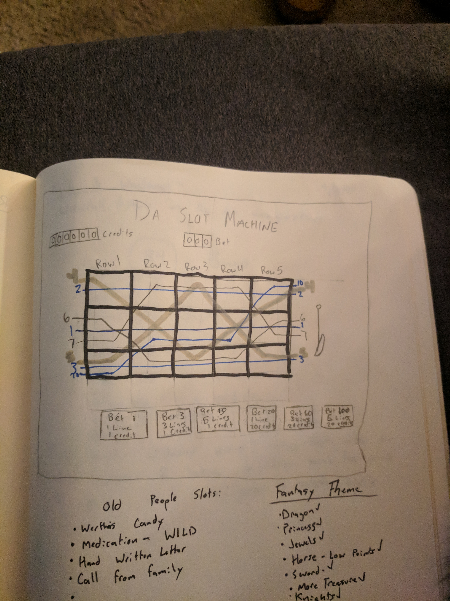

# project-1-game
## Project 1 - Star Wars Slots

For the first project in the WDI course at GA, I decided to make a slot-machine game with a Star Wars theme.
I was inspired by a family birthday party at a local casino the weekend before that got me thinking it would be fun and challenging to recreate a similar game with my own themes. My initial thought was to make the game themed in such a way that would attract the elderly, the main users of these "penny-slots" but after a night of thinking about it, I decided to change things up and make it Star Wars themed, something that i assumed would be more flashy and more interesting to myself. I enjoy the Star Wars franchise and didn't notice any games with that theme at the casino I patroned, so I thought it would be a fun project.

### Getting Started:
To start, I looked into slot machines, how the paylines work, what kind of bets the user makes and how I should organize my board. I first decided I wanted to make a gameboard with 3 rows, 5 columns, and 7 possible paylines depending on the bets chosen, but quickly decided on just 5 paylines for the sake of rounder numbers in my bets. The paylines i settle for were as follows:
1. Line 1 - straight across the middle row
1. Line 2 - straight across the top row
1. Line 3 - straight across the bottom row
1. Line 4 - an angled line, starting at the bottom of the first row, moving diagonally towards the middle column of the top row, then moving back down diagonally towards the final column of the bottom row.
1. Line 5 - inverse of line 4, starting at the top, moving down towards the center, then back up towards the final column of the top row.

I decided to only require 3 of the 5 elements in a row for my victory condition, believing that requiring all 5 to be the same to be too rare. I chose an array of 10 images and having 5 of them all line up is 1 in 100,000 odds. Even if the house always wins, that a little too long of odds for the user.

For my bets, i decided to give the user three options of paylines and the chance to multiply their bets by 20. Although I couldn't decide on how much the user should win on each bet, the  6 bets i decided on putting on my gameboard were:
1. Bet 1 - Only Payline 1 as possible victory
1. Bet 3 - Paylines 1-3 as possible victory
1. Bet 5 - All 5 paylines
1. Bet 20 - same as Bet 1 but with 20x greater reward
1. Bet 60 - same as Bet 3 but with 20x greater reward
1. Bet 100 - same as Bet 5 but with 20x greater reward


### Initial Wireframe:
Although I am a terrible artist, I decided to wireframe out my page before I went to work on actually coding the board


I worked to recreate this board in html and css as well as find my array of images for the slots before i worked on any game logic. I searched through transparent images withing the star wars universe so that i could have images appear on whatever background image i chose without being strange colors and off-theme. The background I found was from a hyper-drive jump. It mached my theme well but also gave me a canvas that wasn't too difficult to place images over.
I found and downloaded a star wars font that someone had developed online for free use and used it to style the majority of my fonts, with a "Robotic" google font that seemed like a suitable contrast.
Instead of a pull-handle, i thought it would be better to have a light-saber that the user could pull(or click) to activate the game.
With that backbone, I began to work on the javascript logic of my game.

### Javascript logic
I broke down my game into 3 important functions i needed to accomplish for my game to be operational
* On-click event that ran the game board
* Game board display with random images chosen from an array that would change on each lever pull
* Determine winners based on game state after the lever has been pulled

I decided quickly that I wanted the lever to animate and move and then return to it's intial position shortly after. At the beginning of my on-click function, i gave the lightsaber a class style that involved a 45degree rotation and after a short amount of time, removed that class so that the image would return to its "unpulled" position. 
After i got the click animation, i figured i should give it something to do, so I went to work on putting the images on the gameboard. I first wanted to make the images spin in an array in a similar animation to what you see in traditional slot machines, but ran into too many challenges(more on this later). I decided I would first get the images to appear and then work on styling later. I started by using Math.random and used that random number compiled to chose an image in my array and put that image in my table of elements. I started with vanilla javascript to achieve this, then moved to jquery when i thought it might help me keep my code dry and help in my logic for determining game wins. After trial and error however, i figured out that jquery was making all of my variables that were equal to Math.random equal the same number as it ran through a loop and not give each variable a new value for Math.random. I was able to make my spins rather dry after a little bit of trial and error. Here is the code i used for each column:
```
function drySpin(num) {
    var randomFirst = Math.floor(Math.random()*10);
    var randomSecond = Math.floor(Math.random()*10);
    var randomThird = Math.floor(Math.random()*10);
    middleRow[num].appendChild(document.createElement("img")).src = slotImages[randomFirst].source;
    middleRow[num].childNodes.className = slotImages[randomFirst].name;
    topRow[num].appendChild(document.createElement("img")).src = slotImages[randomSecond].source;
    topRow[num].childNodes.className = slotImages[randomSecond].name;
    bottomRow[num].appendChild(document.createElement("img")).src =slotImages[randomThird].source;
    bottomRow[num].childNodes.className = slotImages[randomThird].name;
};
```


Resources and Contributor:
* http://www.vegasslotsonline.com/features/paylines/ - figured out which paylines i wanted to use.
